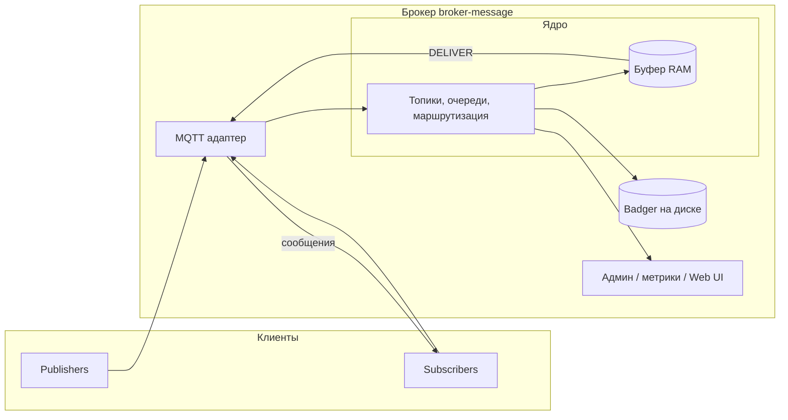

# broker-message

Брокер сообщений на **Go**: паттерн **Publisher / Subscriber**, топики и очереди, доставка **потоком** (streaming), порядок **FIFO** в рамках одного потока. Протокол клиентов — **MQTT**.

## Что делаем и зачем

| Что | Зачем |
|-----|--------|
| Внутреннее ядро Pub/Sub и протокол **MQTT** (TCP, при необходимости WebSocket) | Единый стандартный способ подключать издателей и подписчиков; знакомая модель топиков и QoS. |
| **Топики и очереди**: создание, удаление, управление; метаданные в **Badger** | Разделить потоки данных и управлять ими как именованными ресурсами. |
| **Публикация** (`PUBLISH`) и **подписка** (`SUBSCRIBE`) с фильтрами по маскам | Отправлять события в нужные каналы и получать только интересующие сообщения. |
| **Персистентность** в Badger, восстановление после перезапуска | Сообщения и состояние не теряются при остановке процесса или контейнера. |
| **QoS 1**: идентификаторы пакетов, PUBACK, смещения подписчиков | Гарантия доставки хотя бы один раз и согласованное поведение при сбоях сети и рестартах. |
| **SDK на Go**: connect, publish, subscribe, контексты, ошибки, **переподключение** | Удобная интеграция приложений без ручной сборки MQTT-клиента и обработки edge cases. |
| **Документация**: README, [docs/ARCHITECTURE.md](docs/ARCHITECTURE.md), godoc / API docs | Быстрый онбординг, понятные границы системы и контракт для клиентов. |
| **Docker** и **docker-compose**, том под данные, `docs/BUILD.md` под разные архитектуры | Воспроизводимый запуск везде и простая выкладка без ручной установки зависимостей. |
| **Демо**: три микросервиса с подробным логом, сценарий через compose | Наглядно показать цепочку «публикация → несколько подписчиков» без ручной сборки тестов. |
| **TTL** сообщений | Автоматически убирать устаревшие данные и ограничивать рост хранилища. |
| **DLQ** | Откладывать проблемные сообщения отдельно, чтобы не блокировать основную очередь. |
| **Prometheus** (`/metrics`) | Наблюдаемость: нагрузка, ошибки, глубина очередей без доступа к логам. |
| **Аутентификация и ACL** по топикам | Ограничить, кто может публиковать и подписываться в общей среде. |
| **Web UI** | Быстрый просмотр состояния брокера без консольных инструментов. |

## Технологии

| Категория | Выбор |
|-----------|--------|
| Язык | Go |
| Хранение | [Badger](https://github.com/dgraph-io/badger) (NoSQL KV, файлы на диске) |
| Протокол | MQTT |
| Деплой | Docker, docker-compose |

## Архитектура (высокий уровень)



Та же схема с **потоком сообщений** (стрелки PUBLISH, SUBSCRIBE, DELIVER, буфер, persist): **[docs/broker-architecture.drawio](docs/broker-architecture.drawio)** — открыть в [diagrams.net](https://app.diagrams.net/) (File → Open).

Подробнее — в **[docs/ARCHITECTURE.md](docs/ARCHITECTURE.md)**.

## Модель данных и формат сообщений

- **Топики** — иерархические имена MQTT; **очереди** — логические сущности, сопоставленные с топиками в ядре.
- **Стриминг** — последовательность `PUBLISH`; подписчики получают сообщения по мере поступления.
- **FIFO** — порядок по монотонному `seq` в пределах топика или очереди.

Внутреннее представление сообщения (логическое):

| Поле | Назначение |
|------|------------|
| `seq` | Монотонный номер |
| `topic` | Топик / очередь |
| `payload` | Полезная нагрузка |
| `received_at` | Время приёма брокером |
| `expires_at` | Для TTL, если включено |

Поэтапный план работ — **[IMPLEMENTATION_PLAN.md](docs/IMPLEMENTATION_PLAN.md)**.

---

## Запуск стенда (брокер + Prometheus + Grafana)

```bash
make tls-dev          # self-signed TLS (опционально для :8883)
make compose-up       # docker compose в deploy/
# Admin UI:     http://localhost:8080  (admin / admin)
# Prometheus:   http://localhost:9091
# Grafana:      http://localhost:3000  (admin / admin)
# MQTT plain:   localhost:1883
# MQTT TLS:     localhost:8883
```

Локально без Docker:

```bash
make build && make run
```

Конфиг: [config/broker.yaml](config/broker.yaml), пользователи MQTT: [config/users.yaml](config/users.yaml).

## Envelope и дедупликация (QoS 1)

Клиенты SDK кодируют в `PUBLISH` payload **бинарный конверт** (см. `core/envelope`):

| Поле | Размер | Назначение |
|------|--------|------------|
| magic | 4 | `BMQ1` |
| version | 1 | `0x01` |
| idempotency_id | 16 | UUID producer — повторная отправка с тем же id не создаёт второе сообщение |
| server_msg_id | 16 | UUID брокера — при retransmit (DUP) тот же id; SDK consumer отбрасывает повтор |
| publish_ts_ns | 8 | unix nano |
| user_payload | rest | данные приложения |

- **Producer dedup**: брокер хранит `idempotency_id` в LRU + Badger (TTL ~10 мин).
- **Consumer dedup**: SDK ведёт LRU по `server_msg_id` (повторная доставка после timeout PUBACK не вызывает handler дважды).

## Безопасность

- **MQTTS** `:8883` — TLS (`config/tls/server.pem`, `server.key`; `make tls-dev`).
- **CONNECT**: username/password + ACL по топикам (`config/users.yaml`).
- Отказ: `ConnRefusedBadCredentials` / `ConnRefusedNotAuthorised`.

## Метрики

HTTP `:9090/metrics` — Prometheus counters/gauges: `mqtt_connections_active`, `mqtt_publish_total`, `mqtt_publish_duplicates_total`, `mqtt_deliver_total`, `mqtt_retransmit_total`, `mqtt_inflight_messages`, `broker_dedup_cache_size`.

## Admin UI

`:8080` — логин/пароль из `broker.yaml` (`admin_user` / `admin_password`).

- обзор состояния, клиенты, топики, сообщения;
- live tail (WebSocket `/api/topics/{name}/tail`);
- replay диапазона (`POST /api/topics/{name}/replay?from=&to=`);
- purge топика, graceful restart MQTT;
- CSRF-токен после login для mutating API.

## SDK

**Go** — `sdk/go/brokermq`:

```go
client, _ := brokermq.Connect(ctx, "localhost:1883",
    brokermq.WithCredentials("pub", "pub"),
    brokermq.WithQoS(1),
)
_ = client.Publish(ctx, "hello", []byte("hi"))
```

Примеры: [example/publisher](example/publisher), [example/consumer](example/consumer).

**Python** — `sdk/python` (`pip install -e ./sdk/python`):

```python
client = Client(username="sub", password="sub")
await client.connect()
await client.publish("hello", b"hi")
async for topic, env in client.messages("hello"):
    print(topic, env.payload)
```
