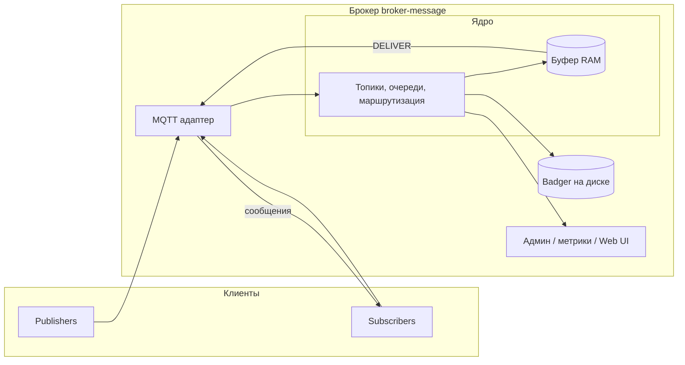

# broker-message

Брокер сообщений на **Go**: паттерн **Publisher / Subscriber**, топики и очереди, доставка **потоком** (streaming), порядок **FIFO** в рамках одного потока. Протокол клиентов — **MQTT**.

## Что делаем и зачем

| Что | Зачем |
|-----|--------|
| Внутреннее ядро Pub/Sub и протокол **MQTT** (TCP, при необходимости WebSocket) | Единый стандартный способ подключать издателей и подписчиков; знакомая модель топиков и QoS. |
| **Топики и очереди**: создание, удаление, управление; метаданные в **Badger** | Разделить потоки данных и управлять ими как именованными ресурсами. |
| **Публикация** (`PUBLISH`) и **подписка** (`SUBSCRIBE`) с фильтрами по маскам | Отправлять события в нужные каналы и получать только интересующие сообщения. |
| **Персистентность** в Badger, восстановление после перезапуска | Сообщения и состояние не теряются при остановке процесса или контейнера. |
| **QoS 1**: идентификаторы пакетов, PUBACK, смещения подписчиков | Гарантия доставки хотя бы один раз и согласованное поведение при сбоях сети и рестартах. |
| **SDK на Go**: connect, publish, subscribe, контексты, ошибки, **переподключение** | Удобная интеграция приложений без ручной сборки MQTT-клиента и обработки edge cases. |
| **Документация**: README, [docs/ARCHITECTURE.md](docs/ARCHITECTURE.md), godoc / API docs | Быстрый онбординг, понятные границы системы и контракт для клиентов. |
| **Docker** и **docker-compose**, том под данные, `docs/BUILD.md` под разные архитектуры | Воспроизводимый запуск везде и простая выкладка без ручной установки зависимостей. |
| **Демо**: три микросервиса с подробным логом, сценарий через compose | Наглядно показать цепочку «публикация → несколько подписчиков» без ручной сборки тестов. |
| **TTL** сообщений | Автоматически убирать устаревшие данные и ограничивать рост хранилища. |
| **DLQ** | Откладывать проблемные сообщения отдельно, чтобы не блокировать основную очередь. |
| **Prometheus** (`/metrics`) | Наблюдаемость: нагрузка, ошибки, глубина очередей без доступа к логам. |
| **Аутентификация и ACL** по топикам | Ограничить, кто может публиковать и подписываться в общей среде. |
| **Web UI** | Быстрый просмотр состояния брокера без консольных инструментов. |

## Технологии

| Категория | Выбор |
|-----------|--------|
| Язык | Go |
| Хранение | [Badger](https://github.com/dgraph-io/badger) (NoSQL KV, файлы на диске) |
| Протокол | MQTT |
| Деплой | Docker, docker-compose |

## Архитектура (высокий уровень)

Та же схема с **потоком сообщений** (стрелки PUBLISH, SUBSCRIBE, DELIVER, буфер, persist): **[docs/broker-architecture.drawio](docs/broker-architecture.drawio)** — открыть в [diagrams.net](https://app.diagrams.net/) (File → Open).

Подробнее — в **[docs/ARCHITECTURE.md](docs/ARCHITECTURE.md)**.

## Модель данных и формат сообщений

- **Топики** — иерархические имена MQTT; **очереди** — логические сущности, сопоставленные с топиками в ядре.
- **Стриминг** — последовательность `PUBLISH`; подписчики получают сообщения по мере поступления.
- **FIFO** — порядок по монотонному `seq` в пределах топика или очереди.

Внутреннее представление сообщения (логическое):

| Поле | Назначение |
|------|------------|
| `seq` | Монотонный номер |
| `topic` | Топик / очередь |
| `payload` | Полезная нагрузка |
| `received_at` | Время приёма брокером |
| `expires_at` | Для TTL, если включено |

Поэтапный план работ — **[IMPLEMENTATION_PLAN.md](docs/IMPLEMENTATION_PLAN.md)**.
